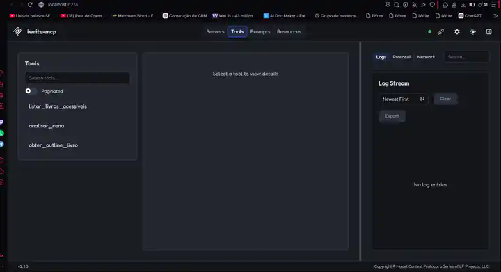
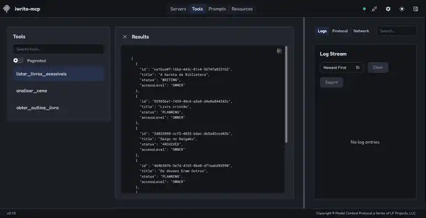
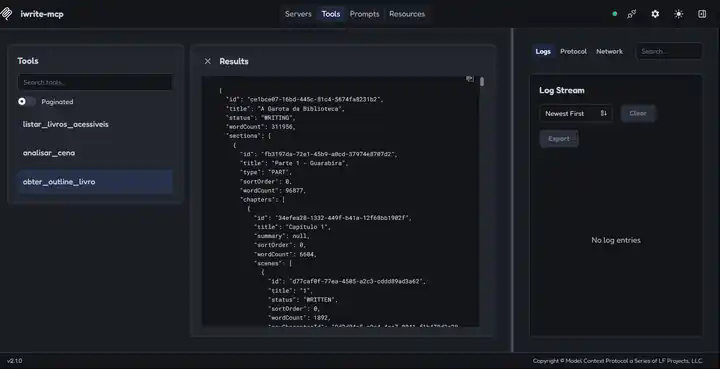
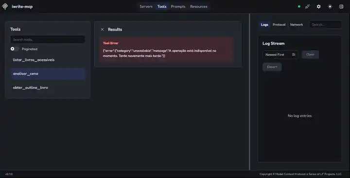
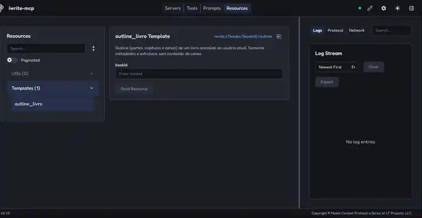
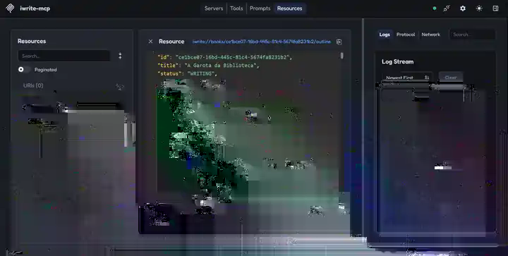

# Evidências visuais — MCP

Validação realizada em **08/08/2026** no **MCP Inspector v2.1.0**, conectado por SSE em `http://localhost:8085/sse`, com o backend limitado a loopback conforme a configuração suportada do IWrite.

## 1. Tools descobertas

O Inspector exibiu exatamente as três tools esperadas: `listar_livros_acessiveis`, `obter_outline_livro` e `analisar_cena`.

## 2. Listagem real de livros

`listar_livros_acessiveis` retornou livros realmente acessíveis à identidade de desenvolvimento.

## 3. Outline real por tool

`obter_outline_livro` retornou a estrutura aninhada de um livro real, com partes, capítulos e cenas, sem conteúdo integral das cenas.

## 4. Erro de análise sanitizado

Com a IA desabilitada, `analisar_cena` retornou a categoria `unavailable` sem stack trace ou detalhes internos.

## 5. Resource template

O Inspector descobriu `iwrite://books/{bookId}/outline` em **Resources**.

## 6. Resource lido com sucesso

A leitura do resource para um livro real retornou `application/json` com o outline autorizado.

