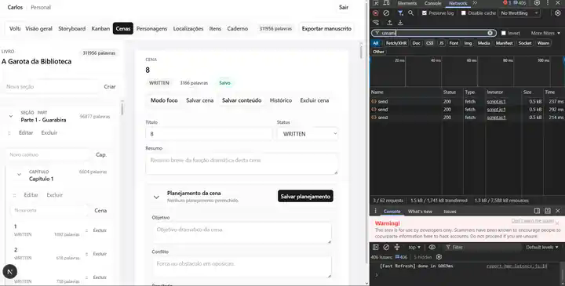
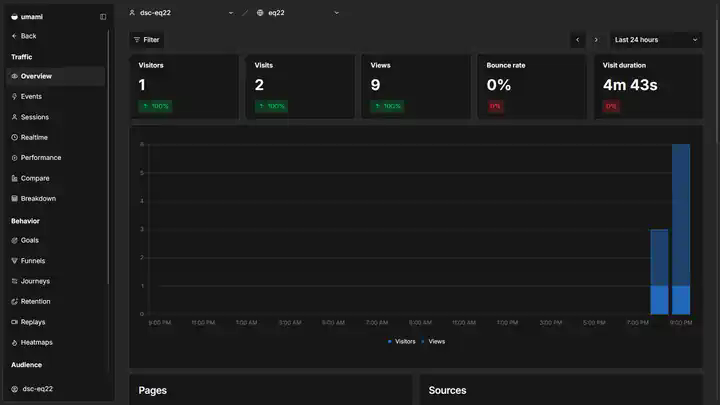

# Evidências visuais — Umami

Validação realizada em **08/08/2026** com o frontend local do IWrite (`localhost:3000`) enviando dados para a instância institucional `https://umami.dsc.rodrigor.com`.

> A validação do deploy remoto `eq22.dsc.rodrigor.com` continua pendente. O Website ID real não é versionado.

## 1. Coleta HTTP 200

Requisições `send` iniciadas pelo tracker e aceitas pelo servidor institucional com HTTP `200`.

## 2. Overview de tráfego

Painel institucional exibindo visitante, visitas e page views recebidas da sessão de validação.

## 3. Páginas sanitizadas

A navegação de livro aparece como `/books/{id}`, sem expor o UUID real. Também são visíveis `/`, `/login`, `/dashboard` e `/library`.

## 4. Eventos customizados

Eventos reais gerados por ações na aplicação: `scene_saved`, `book_exported` e `book_created`.

